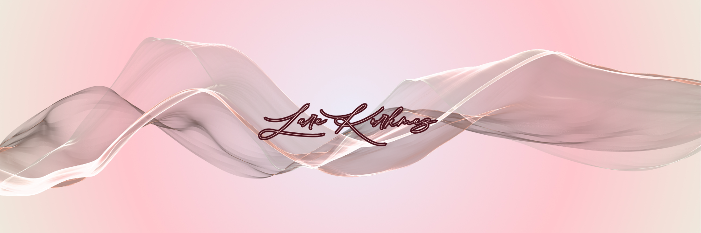

  

<h1 align="center">Hi, I'm Lara!</h1>

  <b>Computer Engineering Student • Game Developer</b>

  I build games, interactive systems, and software with a strong focus on gameplay, multiplayer, UI/UX, and visual polish.

  <a href="mailto:larakorkmaz.dev@gmail.com">Email</a> •
  <a href="https://www.linkedin.com/in/ece-lara-korkmaz-a2295b37a/">LinkedIn</a> •
  <a href="https://github.com/larakorkmaz">GitHub</a>

---

## About Me

I'm a **Computer Engineering student** focused on game development and interactive software.

My main interests are:

- 🎮 Gameplay programming and game systems
- 🌐 Multiplayer networking
- 🧠 AI and computer vision
- 🎨 UI/UX and game interface design
- 🧊 Stylized 3D art and environments
- 📱 Mobile and web development

I enjoy taking projects from idea to playable prototype — including programming, UI design, 3D assets, systems design, testing, and iteration.

---

## Currently Building

### 🫘 Mean Beans

A multiplayer social deduction game built in **Unity**.

I'm developing the project end-to-end, including gameplay systems, multiplayer networking, UI, character systems, voice chat, 3D assets, and game flow.

**Key systems**
- Photon Fusion multiplayer
- Vivox voice chat
- Lobby and ready systems
- Roles and social deduction mechanics
- Kill, death, ghost and spectator systems
- Character customization
- Custom game UI
- Blender-made stylized assets

**Tech:** `Unity` `C#` `Photon Fusion` `Vivox` `Blender` `Figma`

> Repository is currently private while the game is in development.

---

## Featured Projects

### 🤟 SignVisionAI

Computer vision project for capturing hand landmarks and building datasets for sign language recognition.

**Built with:** `Python` `OpenCV` `MediaPipe`

[View repository](https://github.com/larakorkmaz/SignVisionAI)

---

### 🧟 WaveBreaker

A Roblox zombie survival game focused on defending a base, surviving enemy waves, managing inventory, and progressing through runs.

**Systems include**
- Wave-based zombie spawning
- Multiplayer lobby and matchmaking
- Base building
- Inventory and hotbar
- Consumables and survival stats
- Shared ammunition systems
- Shops, chests and progression

**Built with:** `Roblox Studio` `Luau`

---

### 👩 Woman

A first-person psychological horror project focused on atmosphere, storytelling, environmental interaction, and PS1-inspired visual direction.

**Built with:** `Unity` `C#` `Blender`

---

### 🐍 Python Mini Projects

Small applications built while improving my Python fundamentals and software structure.

- [Pink Clock](https://github.com/larakorkmaz/Pink-Clock)
- [Pink Notepad](https://github.com/larakorkmaz/Pink_Notepad)
- [Python Course Projects](https://github.com/larakorkmaz/PythonCourse)

---

## Tech Stack

### Game Development

  
  
  
  
  

### Programming

  
  
  
  
  
  

### Tools & Technologies

  
  
  
  
  
  

---

## What I'm Learning

- Building production-style multiplayer game systems
- Writing cleaner and more maintainable gameplay code
- Game testing and bug reporting
- Advanced Unity networking
- AI and computer vision
- Shipping more complete, documented projects

---

## GitHub Stats

  
  

---

## Let's Connect

I'm interested in **game development, junior software opportunities, internships, QA/game testing, and collaborative projects**.

  
  

  <i>Building games, learning continuously, and turning ideas into playable systems.</i>

